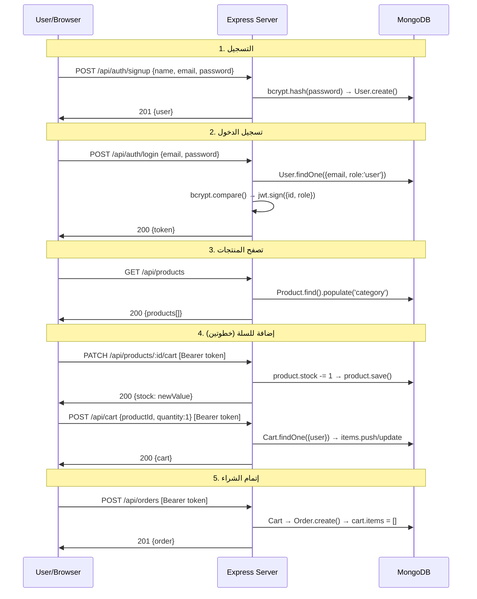

# 🛒 SmartCart Backend — شرح كامل

## التكنولوجيا المستخدمة

| التقنية | الاستخدام |
|---------|----------|
| **Node.js + Express 5** | السيرفر و الـ API |
| **MongoDB + Mongoose 9** | قاعدة البيانات |
| **JWT (jsonwebtoken)** | التوثيق (Authentication) |
| **bcryptjs** | تشفير الباسوردات |
| **express-validator** | التحقق من البيانات (Validation) |
| **cors** | السماح بطلبات Cross-Origin |
| **morgan** | تسجيل الـ HTTP requests |
| **dotenv** | متغيرات البيئة (.env) |

---

## هيكل المشروع (Backend فقط)

```
SmartChart/
├── server.js              ← نقطة البداية
├── app.js                 ← إعداد Express + ربط كل الـ Routes
├── .env                   ← إعدادات البيئة
├── config/
│   └── db.js              ← الاتصال بـ MongoDB
├── models/                ← الموديلز (Mongoose Schemas)
│   ├── User.js
│   ├── Product.js
│   ├── Category.js
│   ├── Cart.js
│   └── Order.js
├── controllers/           ← اللوجيك الرئيسي لكل Route
│   ├── authController.js
│   ├── adminController.js
│   ├── userController.js
│   ├── productController.js
│   ├── categoryController.js
│   ├── cartController.js
│   └── orderController.js
├── routes/                ← تعريف الـ API Endpoints
│   ├── authRoutes.js
│   ├── adminRoutes.js
│   ├── userRoutes.js
│   ├── productRoutes.js
│   ├── categoryRoutes.js
│   ├── cartRoutes.js
│   └── orderRoutes.js
├── middleware/            ← Middleware functions
│   ├── auth.js            ← التحقق من الـ JWT Token
│   ├── isAdmin.js         ← التحقق إن المستخدم Admin
│   ├── validation.js      ← Validation rules
│   └── errorHandler.js    ← معالجة الأخطاء
└── seed/
    └── adminSeeder.js     ← إنشاء أول Admin
```

---

## 1️⃣ نقطة البداية — `server.js` و `app.js`

### server.js
```
dotenv.config()  →  يحمّل متغيرات .env
connectDB()      →  يتصل بـ MongoDB
app.listen(3000) →  يشغّل السيرفر
```

### app.js — ربط كل حاجة ببعض
```
Express Middleware:
├── cors()                    → يسمح بطلبات من أي domain
├── express.json()            → يقرأ JSON body
├── express.urlencoded()      → يقرأ form data
├── morgan('dev')             → يطبع كل request في الـ console
└── express.static('public')  → يقدم ملفات الفرونت

API Routes:
├── /api/auth       → authRoutes
├── /api/admin      → adminRoutes
├── /api/users      → userRoutes
├── /api/products   → productRoutes
├── /api/categories → categoryRoutes
├── /api/cart       → cartRoutes
└── /api/orders     → orderRoutes

Error Handling:
├── 404 handler     → أي route مش موجود يرجع JSON error
└── errorHandler    → Global error handler
```

---

## 2️⃣ الموديلز (Database Schemas)

### 👤 User Model
| الحقل | النوع | الوصف |
|------|------|------|
| `name` | String *(مطلوب)* | اسم المستخدم |
| `email` | String *(مطلوب، فريد)* | الإيميل (lowercase) |
| `password` | String *(مطلوب، ≥6 حروف)* | مشفّر بـ bcrypt |
| `role` | String | `'user'` أو `'admin'` (default: `'user'`) |
| `createdAt` | Date | تاريخ الإنشاء |

> ⚠️ الباسورد يتحذف تلقائياً من أي JSON response عن طريق `toJSON()` method

### 📦 Product Model
| الحقل | النوع | الوصف |
|------|------|------|
| `name` | String *(مطلوب)* | اسم المنتج |
| `description` | String | وصف المنتج |
| `price` | Number *(مطلوب، ≥0)* | السعر |
| `stock` | Number *(مطلوب، ≥0)* | الكمية المتاحة |
| `category` | ObjectId → Category *(مطلوب)* | الفئة |
| `images` | [String] | روابط الصور |
| `brand` | String | الماركة |

> 📊 فيه Indexes على: `price`, `category`, `brand`, `stock`, `name` (text search)

### 📂 Category Model
| الحقل | النوع | الوصف |
|------|------|------|
| `name` | String *(مطلوب، فريد)* | اسم الفئة (مثلاً: Laptops, Mice, Headphones) |
| `description` | String | وصف الفئة |

### 🛒 Cart Model
| الحقل | النوع | الوصف |
|------|------|------|
| `user` | ObjectId → User *(فريد)* | كل يوزر ليه cart واحد بس |
| `items` | Array | قائمة المنتجات |
| `items[].product` | ObjectId → Product | المنتج |
| `items[].quantity` | Number *(≥1)* | الكمية |

### 📋 Order Model
| الحقل | النوع | الوصف |
|------|------|------|
| `user` | ObjectId → User | صاحب الطلب |
| `items` | Array | المنتجات اللي اتطلبت |
| `items[].product` | ObjectId → Product | المنتج |
| `items[].quantity` | Number | الكمية |
| `items[].price` | Number | السعر وقت الشراء |
| `totalPrice` | Number | المجموع الكلي |
| `status` | String | `pending` → `processing` → `shipped` → `delivered` أو `cancelled` |

---

## 3️⃣ الـ Middleware (الطبقات الوسيطة)

### `auth.js` — التحقق من التوكن
```
Request → هل فيه Header "Authorization: Bearer xxx"?
   ↓ لا → 401 "Access denied"
   ↓ نعم → يفك تشفير التوكن بـ jwt.verify()
   ↓ نجح → يحط بيانات اليوزر في req.user = { id, role }
   ↓ فشل → 401 "Invalid or expired token"
```

### `isAdmin.js` — التحقق من صلاحيات الأدمن
```
req.user.role === 'admin'?
   ↓ نعم → يكمل
   ↓ لا → 403 "Admin privileges required"
```

### `validation.js` — التحقق من البيانات
فيه Validation rules لكل عملية:
- **validateObjectId** → يتأكد إن الـ ID صالح
- **validateSignup** → name مطلوب، email صالح، password ≥ 6
- **validateLogin** → email صالح، password مطلوب
- **validateProduct** → name, price, stock, category مطلوبين
- **validateCartItem** → productId صالح، quantity ≥ 1
- **validateOrderStatus** → status واحد من القيم المسموحة
- **validateUserUpdate** → name و email اختياريين بس لازم يكونوا صالحين

### `errorHandler.js` — معالجة الأخطاء
بيتعامل مع:
- `ValidationError` → 400
- `Duplicate Key (11000)` → 409
- `CastError` (Invalid ID) → 400
- `JsonWebTokenError` → 401
- `TokenExpiredError` → 401
- أي خطأ تاني → 500

---

## 4️⃣ الـ API Endpoints — كل الـ Routes

### 🔐 Auth — `/api/auth`
| Method | Route | Middleware | الوصف |
|--------|-------|-----------|------|
| `POST` | `/signup` | validateSignup | تسجيل يوزر جديد (bcrypt hash) |
| `POST` | `/login` | validateLogin | تسجيل دخول يوزر عادي فقط (يرجع JWT) |

> ⚠️ `login` بيدور على `{ email, role: 'user' }` فقط — مش بيسمح للأدمن يسجل دخول من هنا

### 👑 Admin — `/api/admin`
| Method | Route | Middleware | الوصف |
|--------|-------|-----------|------|
| `POST` | `/login` | validateLogin | تسجيل دخول الأدمن فقط (يدور على `role: 'admin'`) |

> ✅ الريسبونس بيرجع `{ token, admin: { _id, name, email, role } }`

### 👥 Users — `/api/users`
| Method | Route | Middleware | الوصف |
|--------|-------|-----------|------|
| `GET` | `/` | verifyToken, checkAdmin | كل اليوزرز (admin فقط) |
| `GET` | `/:id` | verifyToken, checkAdmin | يوزر واحد بالـ ID |
| `PUT` | `/:id` | verifyToken, checkAdmin | تعديل يوزر |
| `DELETE` | `/:id` | verifyToken, checkAdmin | حذف يوزر |

### 📦 Products — `/api/products`
| Method | Route | Middleware | الوصف |
|--------|-------|-----------|------|
| `GET` | `/` | *(عام)* | كل المنتجات (مع فلترة) |
| `POST` | `/` | verifyToken, checkAdmin | إضافة منتج جديد |
| `PATCH` | `/:id/cart` | verifyToken | **تقليل الـ stock بـ 1** (أي يوزر مسجّل) |
| `GET` | `/:id` | *(عام)* | منتج واحد بالـ ID |
| `PUT` | `/:id` | verifyToken, checkAdmin | تعديل منتج |
| `DELETE` | `/:id` | verifyToken, checkAdmin | حذف منتج |

#### فلترة المنتجات (GET `/api/products?...`)
```
?minPrice=500        → السعر أكبر من 500
?maxPrice=2000       → السعر أقل من 2000
?category=ObjectId   → حسب الفئة
?brand=Apple         → حسب الماركة (case-insensitive)
?inStock=true        → المتاح فقط (stock > 0)
?search=macbook      → بحث بالاسم (regex)
```

### 📂 Categories — `/api/categories`
| Method | Route | Middleware | الوصف |
|--------|-------|-----------|------|
| `GET` | `/` | *(عام)* | كل الفئات |
| `GET` | `/:id` | *(عام)* | فئة واحدة |
| `POST` | `/` | verifyToken, checkAdmin | إضافة فئة |
| `PUT` | `/:id` | verifyToken, checkAdmin | تعديل فئة |
| `DELETE` | `/:id` | verifyToken, checkAdmin | حذف فئة |

### 🛒 Cart — `/api/cart`
| Method | Route | Middleware | الوصف |
|--------|-------|-----------|------|
| `GET` | `/` | verifyToken | عرض cart اليوزر الحالي |
| `POST` | `/` | verifyToken, validateCartItem | إضافة/تعديل منتج في الـ cart |
| `DELETE` | `/:productId` | verifyToken | حذف منتج من الـ cart |
| `DELETE` | `/` | verifyToken | تفريغ الـ cart بالكامل |

> 💡 `POST /api/cart` ذكي — لو المنتج موجود بيحدّث الكمية، لو مش موجود بيضيفه

### 📋 Orders — `/api/orders`
| Method | Route | Middleware | الوصف |
|--------|-------|-----------|------|
| `GET` | `/` | verifyToken | طلبات اليوزر (الأدمن يشوف كل الطلبات) |
| `GET` | `/:id` | verifyToken | طلب واحد بالـ ID |
| `POST` | `/` | verifyToken | **إنشاء طلب من الـ cart** |
| `PATCH` | `/:id/status` | verifyToken, checkAdmin | تغيير حالة الطلب (admin فقط) |

> 🔥 `POST /api/orders` بياخد كل اللي في الـ cart، يحسب الـ total، يعمل Order، و **يفضّي الـ cart**

---

## 5️⃣ الـ Flow الكامل — رحلة الشراء



---

## 6️⃣ الـ Admin Seeder

لإنشاء أول أدمن:
```bash
npm run seed
```
ده بيعمل يوزر بالبيانات دي:
- **Email:** `admin@smartcart.com`
- **Password:** `Admin@1234`
- **Role:** `admin`

---

## 7️⃣ التغييرات اللي أنا عملتها في الـ Backend

### ✅ تغيير 1: `controllers/productController.js`
أضفت function اسمها `decreaseStock`:
```js
// PATCH /api/products/:id/cart
// بتنقّص الـ stock بـ 1 لما يوزر يضيف منتج للسلة
const decreaseStock = async (req, res, next) => {
  product.stock -= 1;
  await product.save();
};
```

### ✅ تغيير 2: `routes/productRoutes.js`
أضفت الـ route:
```js
router.patch('/:id/cart', verifyToken, decreaseStock);
```
> ⚠️ حطيتها **قبل** `/:id` عشان Express ما يعتبرش كلمة `cart` إنها ID

### ✅ تغيير 3: `controllers/adminController.js`
أضفت بيانات الأدمن في الـ response:
```js
res.json({
  token,
  admin: { _id, name, email, role }  // ← ده اللي أضفته
});
```
قبل كده كان بيرجع التوكن بس من غير بيانات الأدمن

---

## 8️⃣ Environment Variables (`.env`)

```env
PORT=3000
MONGODB_URI=mongodb://localhost:27017/smartcart
JWT_SECRET=smartcart_jwt_secret_key_2024
JWT_EXPIRES_IN=7d
NODE_ENV=development
```

---

## 9️⃣ أوامر التشغيل

```bash
# تشغيل السيرفر
npm start          # node server.js

# تشغيل مع auto-restart (development)
npm run dev        # nodemon server.js

# إنشاء أول Admin
npm run seed       # node seed/adminSeeder.js
```
